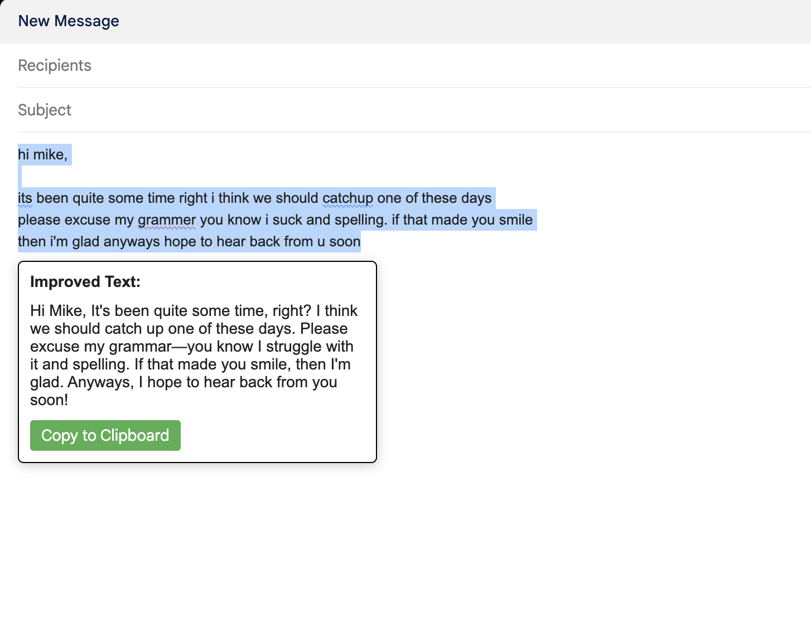

# GPT Text Improver Extension

> I suppose that to build software that other people find useful, you must first build software that YOU find useful.

This is a simple Chrome extension that allows you to select any piece of text from a webpage, improve its grammar using GPT, and copy the improved text to your clipboard.

Pretty basic, I know! But I often found myself constantly switching to ChatGPT, asking it to improve a given piece of text grammatically, copying the response, and pasting the improved version.

